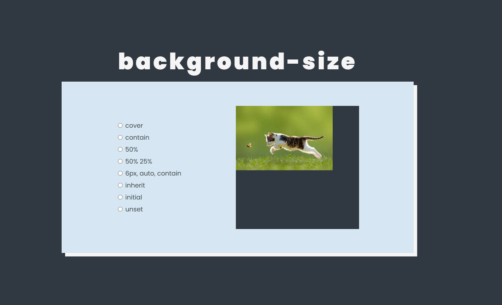

# background-size

> Um site para facilitar a compreensão da propriedade background-size do CSS 💻 A ideia é ser um visualizador da propriedade.

## 📫 Contribuindo para "background-size"

Para contribuir com "background-size", siga estas etapas:

1. Bifurque este repositório.
2. Crie um branch: `git checkout -b <nome_branch>`.
3. Faça suas alterações e confirme-as: `git commit -m '<mensagem_commit>'`
4. Envie para o branch original: `git push origin background-size / main`
5. Crie a solicitação de pull.

Como alternativa, consulte a documentação do GitHub em [como criar uma solicitação pull](https://help.github.com/en/github/collaborating-with-issues-and-pull-requests/creating-a-pull-request).
